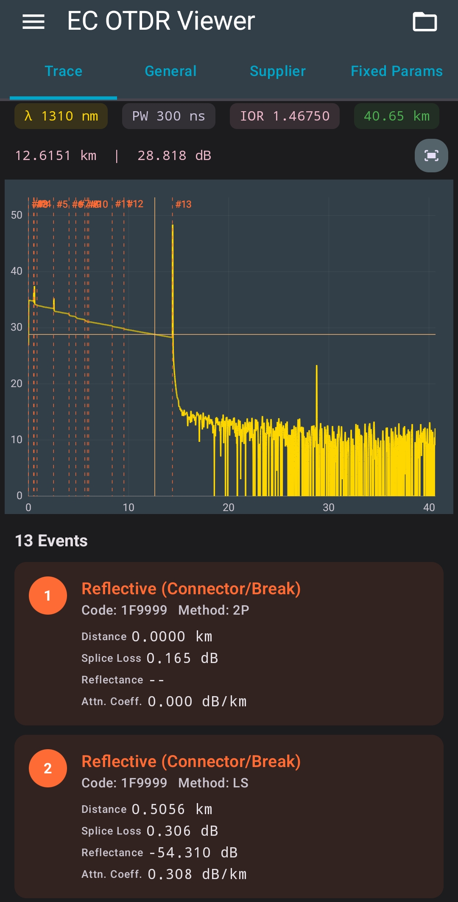
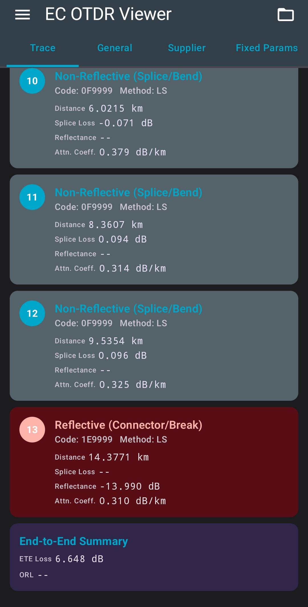
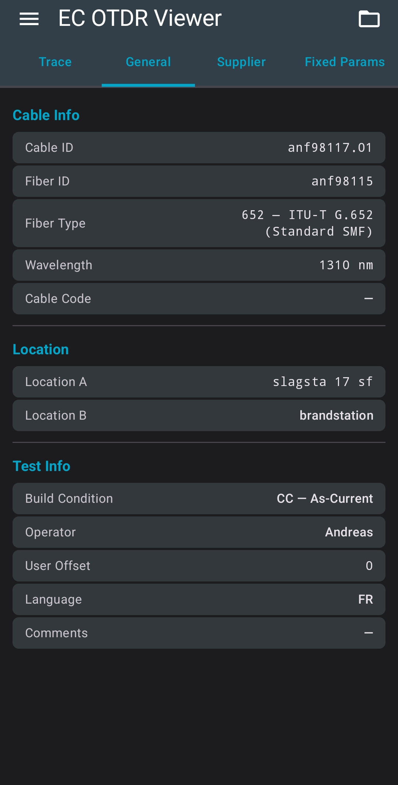
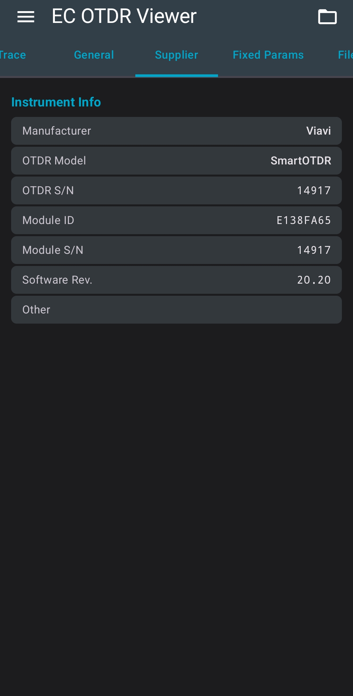
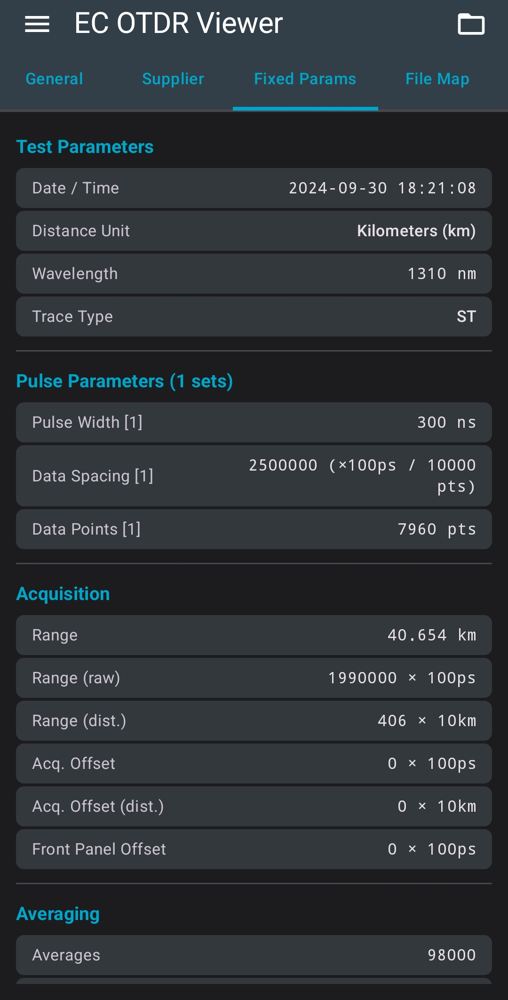
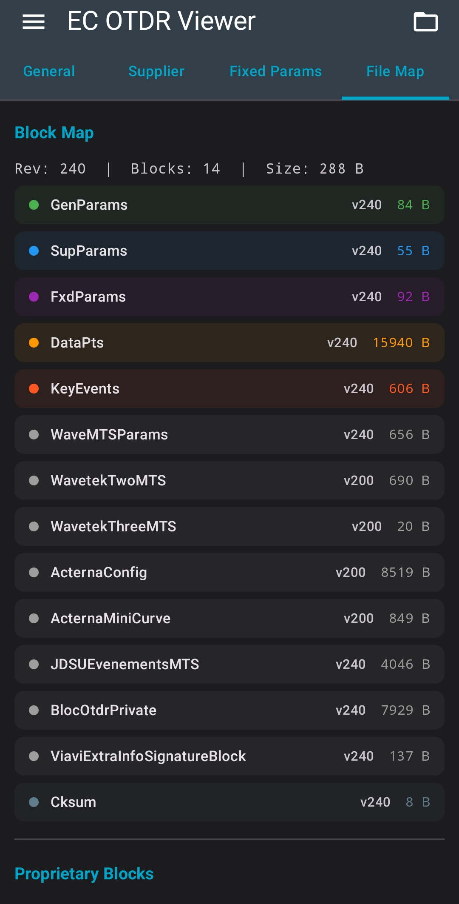

# EC OTDR Viewer
A small Android app for viewing and analyzing OTDR .sor files. It can parse the SOR file format and display the fiber trace and event information.
The app is still under development, and I'm continuing to improve the parser and visualization.

