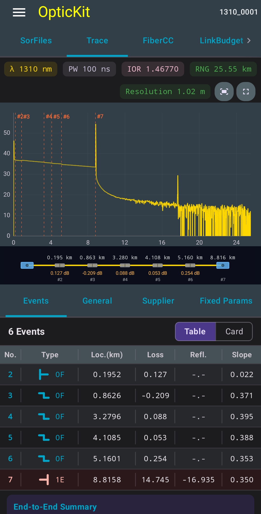
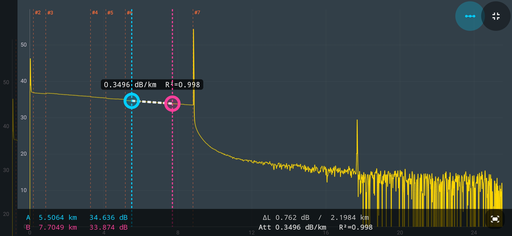

# EC-FusionKit

EC-FusionKit is an Android app for OTDR SOR file viewer, trace comparison, PDF report, fiber color code lookup, optical link budget calculation, and other useful optical fiber tools in a single lightweight application.

Developed and maintained by **EmbeddedChan**.

## 📥 Download

Last updated: 2026-06-20

[Download EC-FusionKit-v1.13.2.apk](https://github.com/EmbeddedChan/otdr-sor-parser/raw/main/apk/EC-FusionKit-v1.13.2.apk)

Please uninstall EC-OpticKit before installing EC-FusionKit.

This app is currently not available on Google Play.

```text
EC FusionKit
│
│
├── Optical
│   ├── SorFiles
│   ├── OTDR Trace
│   ├── Fiber Color Code
│   ├── Link Budget
│   ├── SFP DDM
│   └── Tools 
│
├── Terminal
│   ├── USB Serial Terminal
│   ├── BLE Serial Terminal
│   ├── FTDI Serial Terminal(Dedicated to FTDI USB serial devices)
│   └── SCPI Terminal
│
├── Network
│   ├── UDP
│   ├── TCP Client
│   └── TCP Server
│
├── Programmer(I²C EEPROM, SPI flash, STM32)
│
└── Utilities
     ├── Calculator
     ├── Hex Editor
     ├── HEX/BIN/DEC Converter
     └── Text File Compare
```


## 🖼 UI Preview





Hold the line until the circle grows, then drag · R² closer to 1 = straighter fit


## 📦 Version History

### v1.13.2
- Renamed app to EC FusionKit

### v1.8.4
- Added measurement functionality in OTDR Trace Full View

### v1.8.3
- Added Table View for OTDR event list

### v1.8.2
- Added full-screen view for OTDR trace charts

### v1.8.1
- Fixed a LineChart initialization issue that caused trace lines to appear thinner than expected.

### v1.8.0
- Added distance resolution to Trace view
- Fixed an issue where ".sor" file parsing could occasionally freeze
- Enabled side drawer gesture support for easier navigation
- Added STM32 programming support to the Hex Editor

### v1.6.0
- Added SFP DDM parser module
- Added USB serial terminal
- Added HEX file editor
- Added file comparator
- Improved LinkBudget page state retention when switching pages

### v1.0.3
- Fixed missing Tube Color Code expansion rule handling in Fiber Color Code color lookup
- Fixed an issue causing intermittent cable data loading failures

### v1.0.2
- Fixed crash caused by Android theme switching

### v1.0.1
- Added SCPI raw socket terminal
- Renamed app to EC OpticKit
### v0.9.3
- Added curve comparison mode for easier fiber trace analysis

### v0.9.1
- Added fiber optic color code lookup and mapping module
(Pro, Cable >144 fibers)
### v0.8.2
- Added Link Budget module (configuration save support)
- Added OTDR trace topology view
- Added Splitter Loss Calculator
- Added WDM wavelength/frequency + ITU grid mapping

### v0.8.1
- Added engineering tools module
- Optical power converter
- OTDR time–distance converter

### v0.7.2
- Fixed event data handling in SOR PDF report

### v0.7.1
- Added Link Budget module
- Receiver power check
- Optical link analysis engine

### v0.6.2
- SOR file management added
- MSOR import support
- PDF report editing fields added

### v0.3.0
- PDF report export (Pro, no watermark)
- File name display

### v0.2.1
- Initial release


## Feedback & Support

Welcome your feedback, feature requests, and bug reports.  
Please email me anytime.

Email: embeddedchan@gmail.com

## Licensing

EC-OpticKit is available in two editions:

### Free Version
Includes all standard features, except Pro-exclusive functions.

### Pro Version
Unlocks advanced features, including:
- Watermark-free PDF report export
- Cable fibers >144

## Privacy Policy

This application does not collect personal information.All serial file processing, and engineering tools operate locally on the user's device.

For license validation purposes, the application may generate and transmit a unique installation identifier. This identifier is used solely for professional edition license verification.


## User Manual
 
## Programmer
I2C EEPROM :
AT24C01,AT24C02,AT24C04,AT24C08,AT24C16,AT24C32,AT24C64,AT24C128,AT24C256,AT24C512

SPI Flash :
A25L010, A25L016, A25L020, A25L032, A25L040, A25L05PT, A25L05PU, A25L080, A25L10PT, A25L16PT, A25L20PT, A25LQ64, AT25DF021A, AT25DF081, AT25DL161, AT25F1024A, AT25F2048, AT25F4096, AT25F512A, AT25FS040, AT25SL128A, AT45CS1282, B25D05AS, B25D10AS, B25D20AS, B25D40AS/BY25D40ES, B25D80AS/BY25Q80BS, B25D16AS/BY25Q16BS, B25Q32BS/BY25Q32CS, B25Q64AS/BY25Q64ES, B25Q128AS/BY25Q128ES, ES25P16, ES25P40, ES25P80, F25L008A, F25L32PA, EN25B05, EN25B10, EN25B16, EN25B20, EN25B32, EN25B40, EN25B64, EN25B80, EN25Q128, FM25F005, FM25F01, FM25F02A, FM25F04A, FM25Q08, FM25Q16, FM25Q32, FM25Q64, FM25Q128, GD25Q512, GD25Q10, GD25LQ20, GD25LQ40, GD25LF80E, GD25LF16E, GD25LF32E, GD25LF64E, GD25LF128E, GD25LQ256D, GD25LB512ME, IS25LP064, IS25LP128, IS25LP256, IS25WP032, 25F160S33B8, 25F160S33T8, 25F320S33B8, 25F320S33T8, 25F640S33B8, 25F640S33T8, MX25L512E/V512C, MX25L1005C/1006E, MX25L2005C/2006E, MX25L4005A/4006E, MX25L8005/8006E/V8005, MX25L1605, MX25L3205A, MX25L6405, MX25L12805D, MX25L25635F/25645G, MX66L51235F/25L51245G, MX66L1G45G, MX25U8032E, MX25U1635E, MX25U3235E/F, MX25U6435E/F, MX25U12835F, MX25U25635F, MX25U51245G, M25P05-A, M25P10-A, M25P20, M25P40, M25P80, M25P16, M25P32, M25P64, M25P128, N25Q256..1E, N25Q512..1G, N25Q00A..1G, MT25QL02G, N25S10, N25S20, N25S40, N25S80, N25S16, Pm25LD512C, Pm25LD010C, Pm25LD020C, Pm25LD040C, Pm25LV512A, Pm25LV010, Pm25LV020, Pm25LV080B, Pm25LV016B, Pm25LD256C, Pm25LQ016, Pm25LQ020, Pm25LQ032C, Pm25LQ040, Pm25LQ080, P25Q05H, P25Q10H, P25Q20H, P25Q40H, P25Q80H, P25Q16H, P25Q32H, P25Q64H, P25Q128H, PY25Q256HB, PY25Q512HB, SST25WF512, SST25WF010, SST25WF020, SST25WF040, SST25WF080, SST25VF512A, SST25VF010A, SST25VF016B, SST25VF020B, SST25VF032B, SST25VF040B, SST25VF064C, SST25VF080B, SST25LF020A, SST25LF040A, SST25LF080A, SST26VF032BA, SST26VF080A, SST25WF020A, SST25WF040B, SST25WF080B, LE25FU106B, LE25FU206, LE25FU406B, LE25FW106, LE25FW406A, LE25FW418A, LE25FW806, LE25FW808, S25FL004A, S25FL008A, S25FL016A, S25FL032A/P, S25FL064A/P, S25FL164K, S25FL127S-256kB, S25FL256L, S25FL512S, W25X05, W25X10, W25Q20.W, W25Q40.V, W25P80, W25P16, W25P32, W25Q64BV/CV/FV, W25Q128.V, W25Q256FV, W25Q512JV, XT25F02E, XT25F04D, XT25F08B, XT25F16B, XT25F32B, XT25F64B, XT25F128B, ZD25D20, ZD25D40, ZD25LQ64, ZD25LQ128