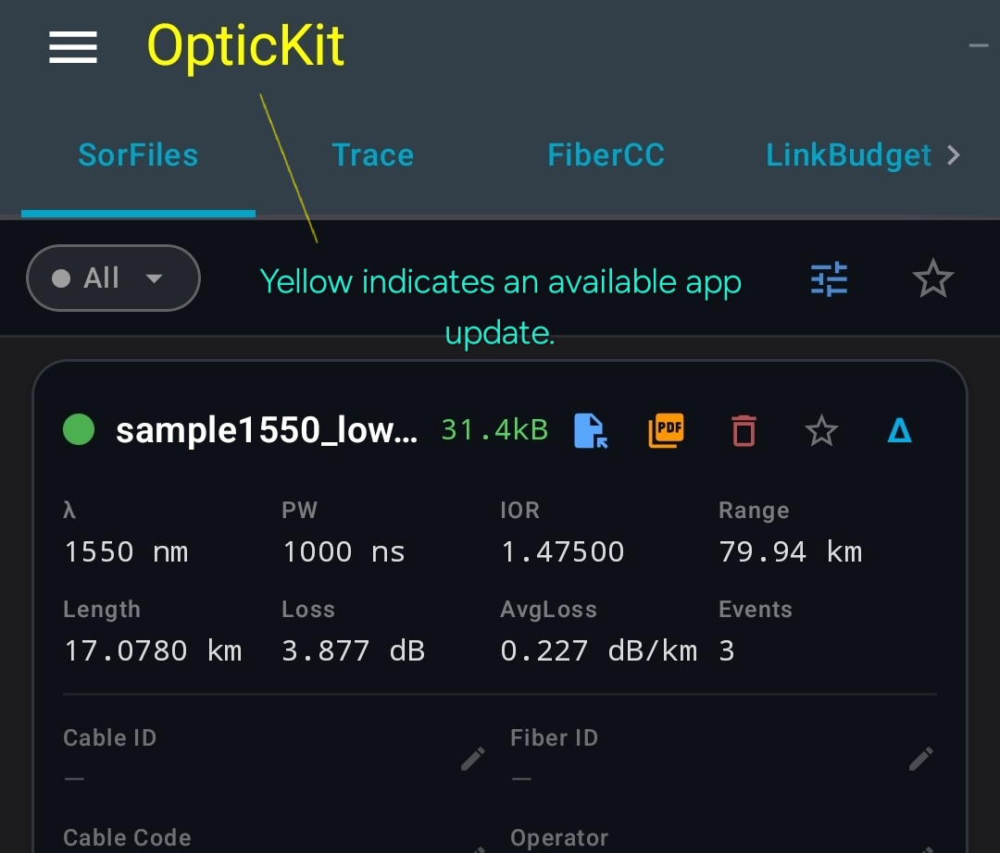
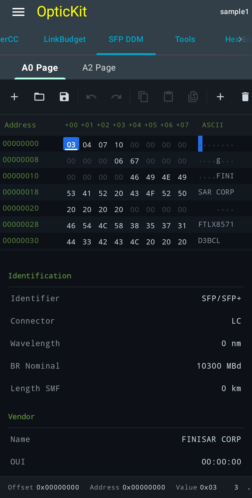
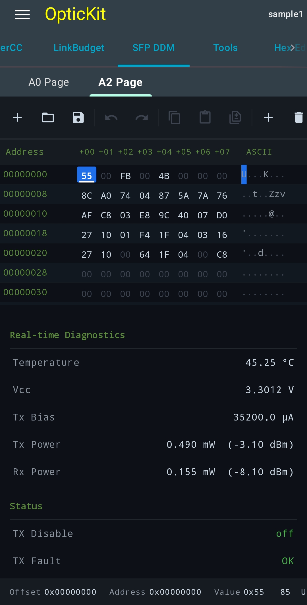
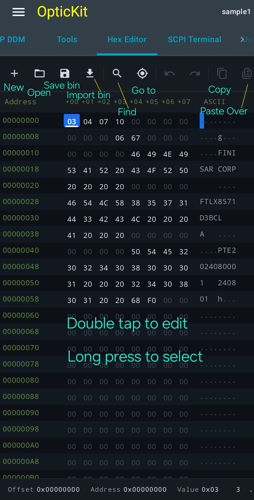

# EC-OpticKit

EC-OpticKit is an Android app for OTDR SOR file viewer, trace comparison, PDF report, fiber color code lookup, optical link budget calculation, and other useful optical fiber tools in a single lightweight application.

Developed and maintained by **EmbeddedChan**.

## 📥 Download

Last updated: May 28, 2026

[Download EC-OpticKit-v1.8.0.apk](https://github.com/EmbeddedChan/otdr-sor-parser/raw/main/apk/EC-OpticKit-v1.8.0.apk)

Please uninstall EC OTDR Viewer before installing EC-OpticKit.

This app is currently not available on Google Play.

## The application includes the following modules:

### SOR Parser Module
- SOR File Management
- OTDR Trace Viewer
- PDF Report Export

### Optical Link Budget Module
- Receiver Power Verification
- High-Speed Optical Link Analysis

### Fiber Optic Color Code Module
- Color Code Lookup
- Fiber cable Mapping

### SFP DDM Parser

### SCPI raw socket terminal
- Raw TCP socket terminal for SCPI instrument control and debugging.

### Tools Module
- Optical Power Converter
- Splitter Loss Calculator
- WDM λ ↔ Frequency / ITU Channel Converter
- OTDR Time-Distance Converter

## 🖼 UI Preview

## 📦 Version History

### v1.8.0
- Added distance resolution to Trace view
- Fixed an issue where ".sor" file parsing could occasionally freeze
- Enabled side drawer gesture support for easier navigation
- Added STM32 programming support to the Hex Editor

### v1.6.0
- Added SFP DDM parser module
- Added USB serial terminal
- Added HEX file editor
- Added file comparator
- Improved LinkBudget page state retention when switching pages

### v1.0.3
- Fixed missing Tube Color Code expansion rule handling in Fiber Color Code color lookup
- Fixed an issue causing intermittent cable data loading failures

### v1.0.2
- Fixed crash caused by Android theme switching

### v1.0.1
- Added SCPI raw socket terminal
- Renamed app to EC OpticKit
### v0.9.3
- Added curve comparison mode for easier fiber trace analysis

### v0.9.1
- Added fiber optic color code lookup and mapping module
(Pro, Cable >144 fibers)
### v0.8.2
- Added Link Budget module (configuration save support)
- Added OTDR trace topology view
- Added Splitter Loss Calculator
- Added WDM wavelength/frequency + ITU grid mapping

### v0.8.1
- Added engineering tools module
- Optical power converter
- OTDR time–distance converter

### v0.7.2
- Fixed event data handling in SOR PDF report

### v0.7.1
- Added Link Budget module
- Receiver power check
- Optical link analysis engine

### v0.6.2
- SOR file management added
- MSOR import support
- PDF report editing fields added

### v0.3.0
- PDF report export (Pro, no watermark)
- File name display

### v0.2.1
- Initial release

## Feedback & Support

Welcome your feedback, feature requests, and bug reports.  
Please email me anytime.

Email: embeddedchan@gmail.com

## Licensing

EC-OpticKit is available in two editions:

### Free Version
Includes all standard features, except Pro-exclusive functions.

### Pro Version
Unlocks advanced features, including:
- Watermark-free PDF report export
- Cable fibers >144

## Privacy Policy

This application does not collect personal information.All serial communication, Modbus, TCP/UDP networking, file processing, and engineering tools operate locally on the user's device.

For license validation purposes, the application may generate and transmit a unique installation identifier. This identifier is used solely to verify software licenses and prevent unauthorized use of premium features.
